# TkCapture
TkCapture is a lightweight screenshot and screen recording tool developed based on Python tkinter.   
It supports screenshot editing and GIF recording, allows you to copy screenshots to the system clipboard,   
and provides an intuitive and user-friendly interface.

## Add Keyboard Shortcuts

| OS      | Steps                                                                                                                                                              |
|---------|--------------------------------------------------------------------------------------------------------------------------------------------------------------------|
| Linux   | 1. Settings 2. Keyboard Shortcuts 3. Add - Name: TkCapture - Command: `python3 <PATH TO>/tk_capture.py` - Shortcut: Ctrl+Shift+A                    |
| Windows | 1. download and unzip windows release zip 2. Right click on tk_capture.exe and send to Desktop Shortcut 3. right click on desktop shortcut of tk_capture.exe 4. Attributes - Shortcut: Ctrl+Shift+A |

## Quick Screenshot

start by command `python3 tk_capture.py` or `Ctrl+Shift+A`

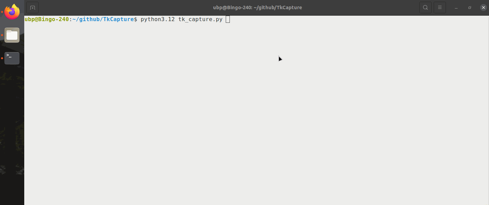

## GIF record

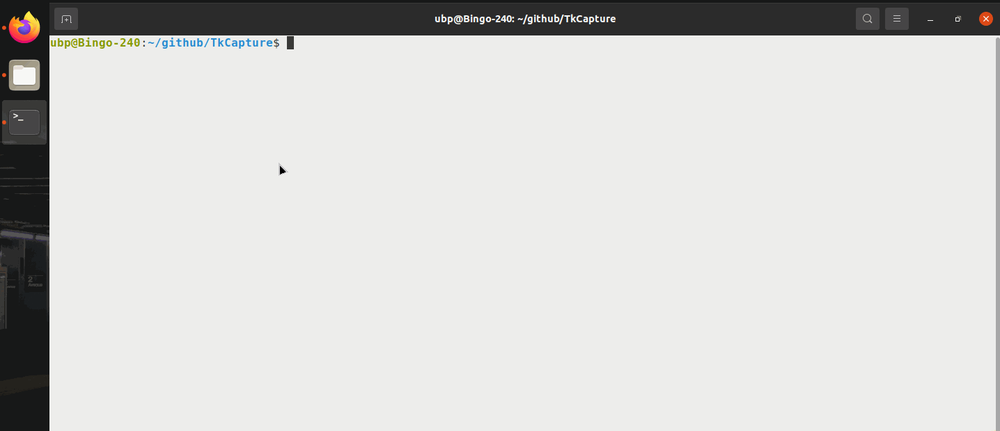

## Adjust range

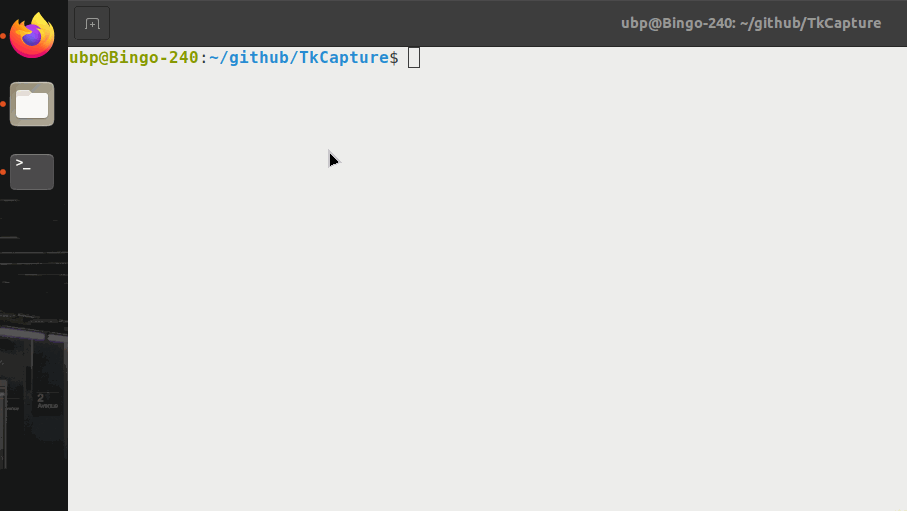

## Rectangle markup

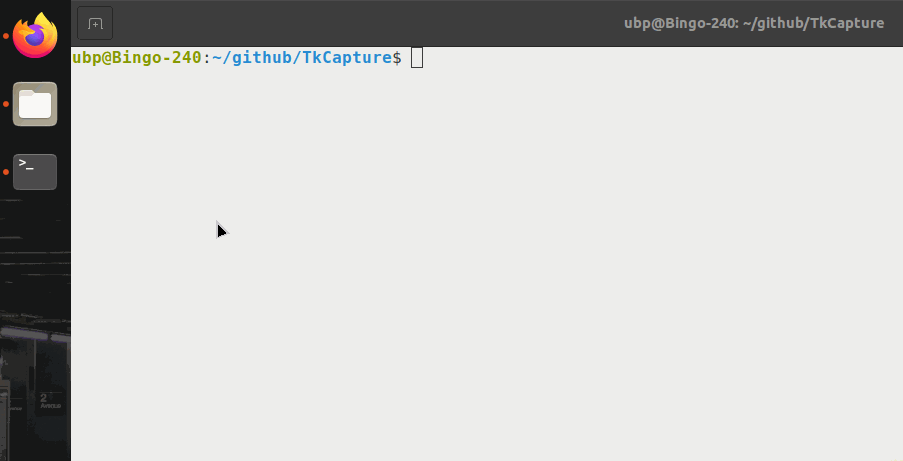

## Circular markup

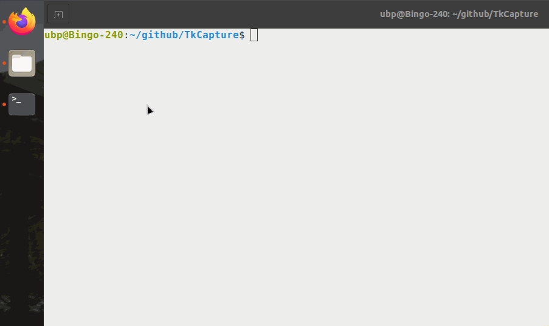

## Line markup

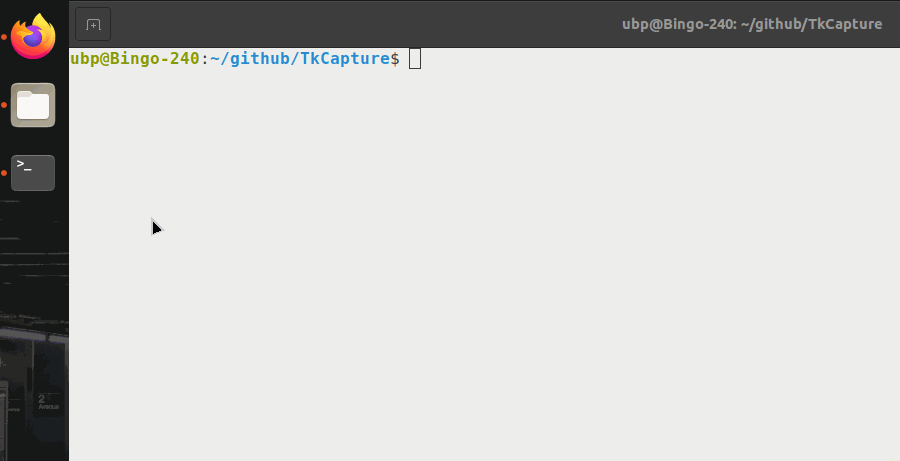

## Arrow markup

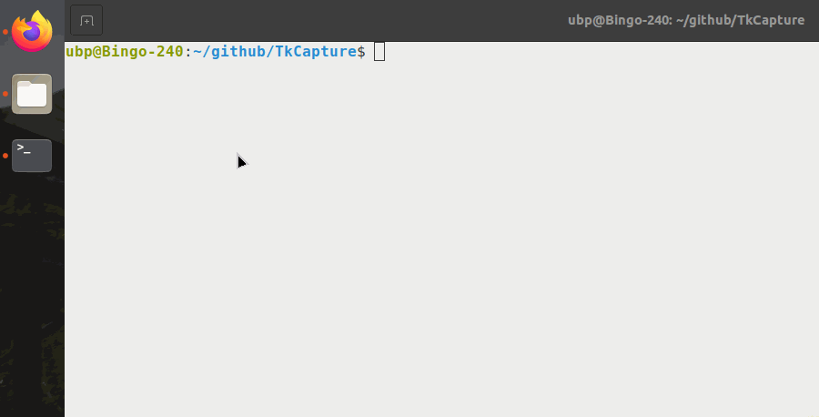

## Pen markup

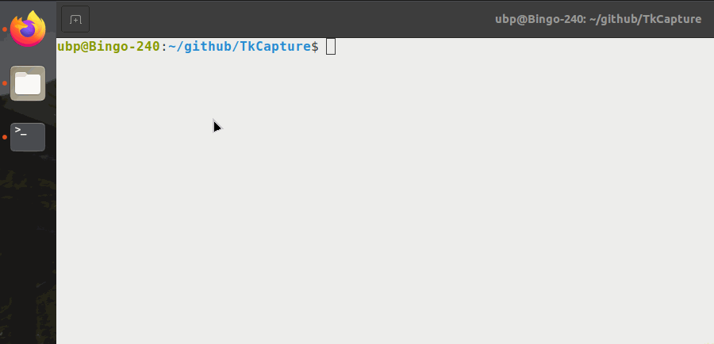

## Text markup

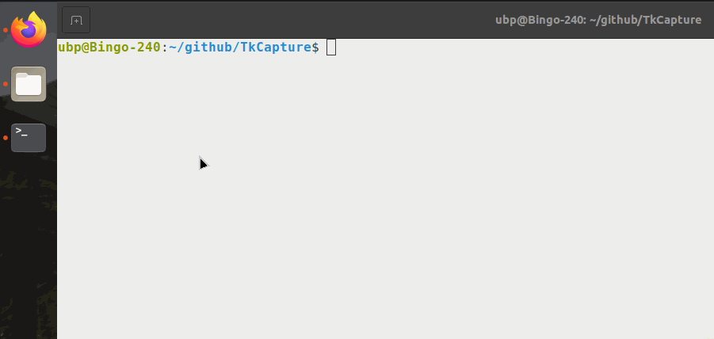

## Mosaic markup

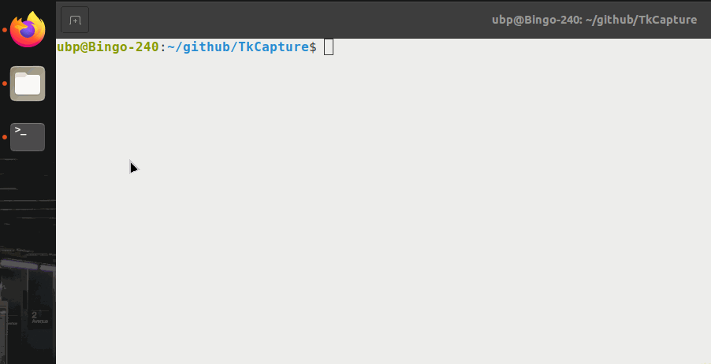

## Markup Styles

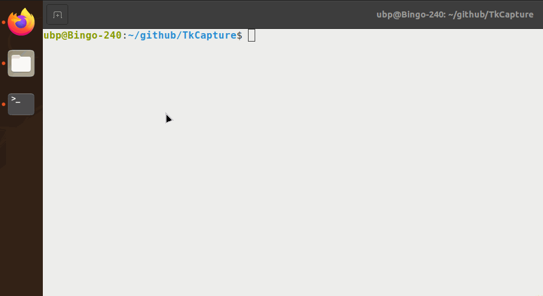

## Revoke
You can revoke each markup from back to front
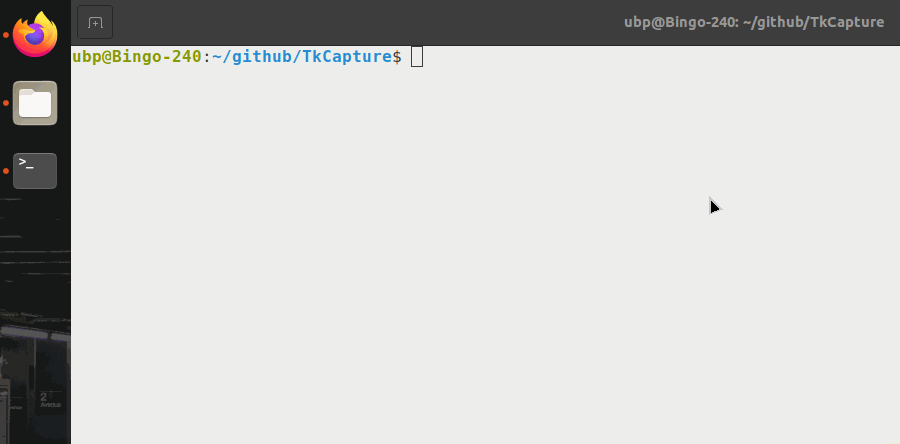

## Hang
You can suspend the screenshot as a reference for other program.
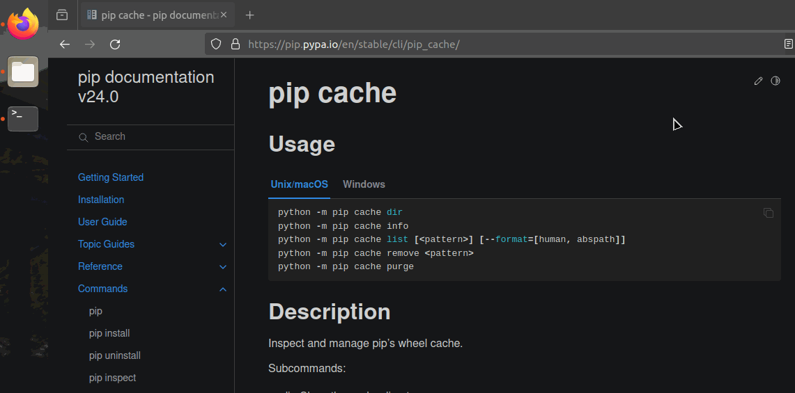

## Settings
You can set preferences here.
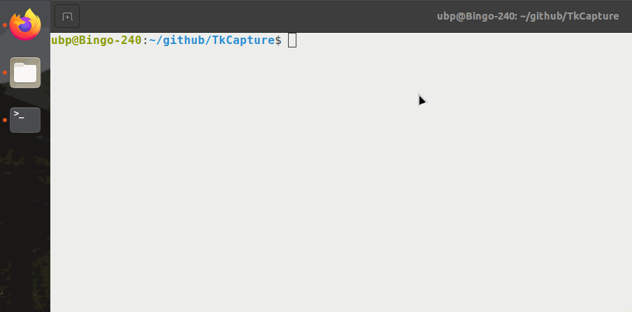

## Move toolbar
You can move the toolbar to any position, even in selection area, so that the time can be seen in the recorded GIF.

